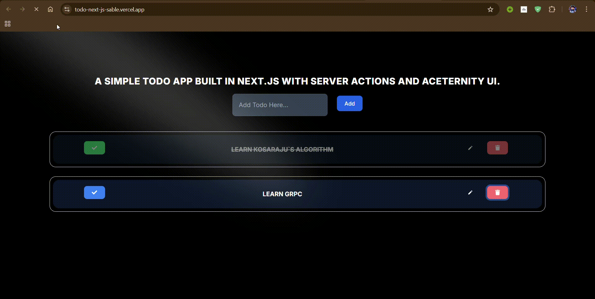

# Todo App 🚀

A feature-rich Todo application built using **Next.js** and **TypeScript**. The app follows **modern development practices**, is **fully responsive**, and leverages **MongoDB** as the database with **Prisma ORM** for database operations. The UI is styled using **Tailwind CSS**.

## 🌟 Features

✅ Add, edit, and delete todos  
✅ Mark todos as completed  
✅ Server Actions for seamless data updates  
✅ Optimized performance with Next.js  
✅ MongoDB database integration with Prisma  

## 🎬 Demo



## 🛠️ Technologies Used

| Technology  | Purpose |
|-------------|---------|
| **Next.js** | React framework for fast and scalable web apps |
| **TypeScript** | Type-safe JavaScript for better code maintainability |
| **Tailwind CSS** | Utility-first CSS for modern styling |
| **MongoDB** | NoSQL database for storing todos |
| **Prisma** | ORM for MongoDB database operations |
| **Framer Motion** | Smooth animations for UI elements |

## 🚀 Getting Started

### 🔹 Prerequisites

Ensure you have the following installed:

- **Node.js** (v14 or higher) → [Download](https://nodejs.org/)
- **MongoDB** (self-hosted or [MongoDB Atlas](https://www.mongodb.com/cloud/atlas))

### 🔹 Installation

1. **Clone the repository**:

   ```bash
   git clone https://github.com/harsh-panchal-804/Todo-NextJS
   cd todo-next-sactions

### Installation

1. Clone the repository:

   ```bash
   git clone https://github.com/harsh-panchal-804/Todo-NextJS
   cd todo-next-sactions
   ```

2. Install dependencies:

   ```bash
   npm install
   ```

3. Create a `.env` file in the root directory and add your MongoDB connection string:

   ```env
   DATABASE_URL="your-mongodb-connection-string"
   ```

4. Run the development server:

   ```bash
   npm run dev
   ```

   Open [http://localhost:3000](http://localhost:3000) with your browser to see the result.

## Project Folder Structure

```plaintext
todo-next-sactions/
├── .env
├── .eslintrc.json
├── .gitignore
├── .next/
├── lib/
│   └── utils.ts
├── next-env.d.ts
├── next.config.mjs
├── package.json
├── postcss.config.mjs
├── prisma/
│   └── schema.prisma
├── public/
│   ├── next.svg
│   └── vercel.svg
├── README.md
├── src/
│   ├── actions/
│   ├── app/
│   ├── components/
│   │   ├── button/
│   │   ├── form/
│   │   │   └── Form.tsx
│   │   ├── input/
│   │   │   └── Input.tsx
│   │   ├── todos/
│   │   │   └── DeleteTodo.tsx
│   │   └── ui/
│   │       ├── Spotlight.tsx
│   │       └── text-generate-effect.tsx
│   ├── types/
│   └── utils/
├── tailwind.config.ts
└── tsconfig.json
```

### Linting

To run ESLint:

```bash
npm run lint
```

## License

This project is licensed under the MIT License.
